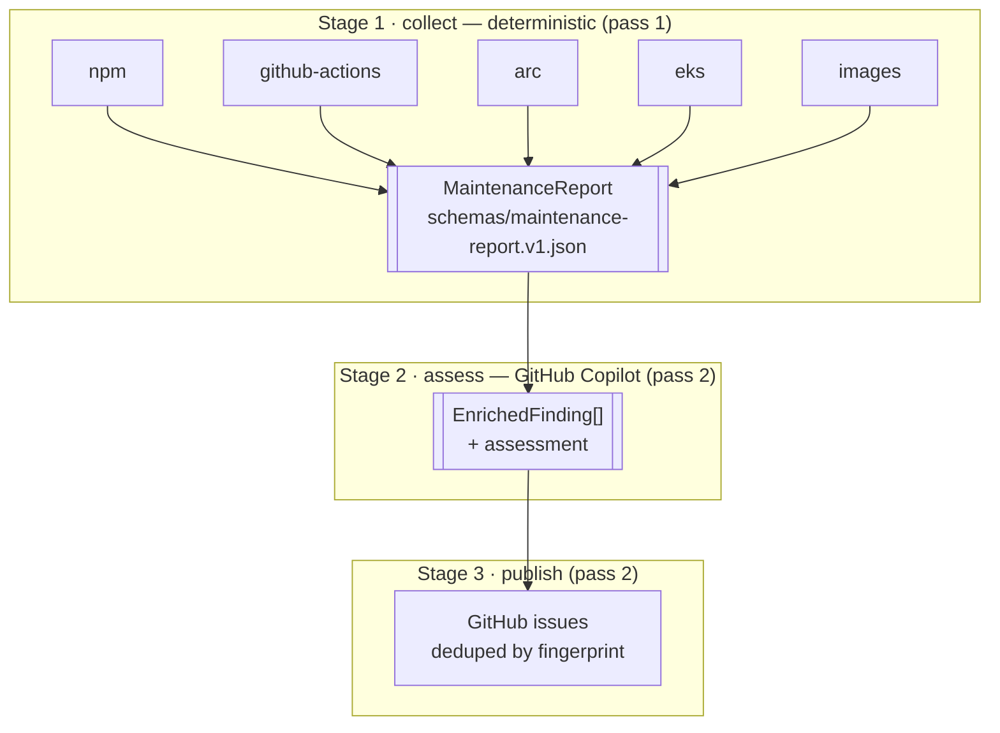

# Pipeline overview

**Status:** Draft — finalised once the collect stage ships
**Related:** [project-brief.md](./project-brief.md) · [schema-contract.md](./schema-contract.md) · [pass-2-interface.md](./pass-2-interface.md) · [runbook.md](./runbook.md)

## Stages

Each collector discovers the **observed** version by parsing a declared file or
running a tool. A separate set of **sources** resolves the **latest** version
upstream. Keeping those apart is what makes both independently testable.

## What each stage may write

| Field group | collect | assess | publish |
| --- | :---: | :---: | :---: |
| `subject`, `versions`, `evidence`, `latestResolution` | write | read | read |
| `severity` (and its rule id) | write | **read only** | read |
| `fingerprint`, `stateHash` | write | read | read |
| `assessment` | **forbidden** | write | read |
| `issue` | **forbidden** | — | write |

The `Finding` schema is a strict object, so a judgement field emitted by a
collector is a parse failure rather than something a reviewer has to notice.
The assess stage may disagree with a severity only by proposing one via
`assessment.suggestedSeverity`.

## Reading a report

Top level:

- `summary.worstStatus` — the health of the *scan*, not the fleet. Anything
  other than `ok` means at least one collector degraded, so absent findings are
  not evidence of absent problems.
- `summary.unresolvedCount` — how many findings could not be resolved upstream.
  Read this before reading the findings.
- `collectorRuns[]` — per-collector status, duration and errors. Start here
  when a collector returns less than expected.

Per finding:

- `severity.severity` with `severity.ruleId` — the level and the rule that
  produced it. Disagree with the rule, not the number.
- `versions.declared` / `.observed` / `.latest` / `.bump` — declared is
  literally what the file says; observed is normalised.
- `latestResolution.method` and `.confidence` — where "latest" came from. A
  `support-calendar` method at `medium` confidence is a committed table, not a
  live lookup.
- `unresolved: true` — the collector could not establish upstream truth.
  `latestResolution.reason` says why. Severity is forced to `info`; this is not
  a claim that the subject is fine.
- `evidence[]` — file and line, argv and exit code, or URL and status. Every
  finding has at least one.

## Status semantics

| Status | Meaning |
| --- | --- |
| `ok` | Ran; every upstream resolution succeeded |
| `partial` | Ran and produced findings, but at least one resolution failed |
| `failed` | Could not produce trustworthy output |
| `skipped` | Disabled in config or not selected on the command line |

The scan job goes red only when the tooling breaks. Findings never fail the
job — a red build for "there is maintenance work" is how a maintenance bot
teaches people to ignore it.
